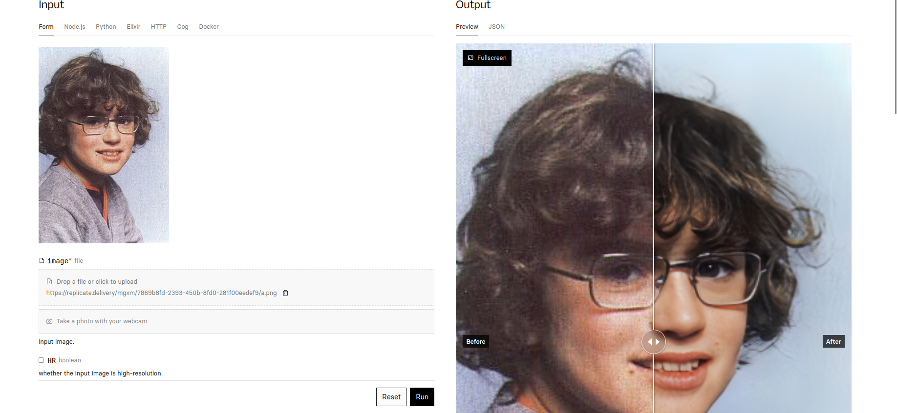

# Old Image Restoration App

This is an application to restore old images using various techniques like face enhancement, global enhancement, and super-resolution.


## Setup

### 1. Clone the Repository

```bash
git clone https://github.com/Afras99/image_restoration_app.git
```

### 2. Navigate to the Project Directory

```bash
cd image_restoration_app/old-image-restoration
```

### 3. Clone and Setup Face Enhancement

```bash
cd Face_Enhancement/models/networks/
git clone https://github.com/Afras99/Synchronized-BatchNorm-PyTorch.git
cp -rf Synchronized-BatchNorm-PyTorch/sync_batchnorm .
cd ../../../
```

### 4. Clone and Setup Global Enhancement

```bash
cd Global/detection_models
git clone https://github.com/Afras99/Synchronized-BatchNorm-PyTorch.git
cp -rf Synchronized-BatchNorm-PyTorch/sync_batchnorm .
cd ../../
```

### 5. Download Face Landmarks Data

```bash
cd Face_Detection/
wget http://dlib.net/files/shape_predictor_68_face_landmarks.dat.bz2
bzip2 -d shape_predictor_68_face_landmarks.dat.bz2
cd ../
```

### 6. Download Pre-trained Checkpoints

```bash
cd Face_Enhancement/
wget https://github.com/Afras99/old-image-restoration/releases/download/v0.5/face_checkpoints.zip
unzip face_checkpoints.zip
cd ../

cd Global/
wget https://github.com/Afras99/old-image-restoration/releases/download/v0.5/global_checkpoints.zip
unzip global_checkpoints.zip
cd ../
```

### 7. Install Required Python Packages

```bash
pip install -r requirements.txt
```

## Super-Resolution with Real-ESRGAN

### 1. Install Real-ESRGAN and Dependencies

```bash
git clone https://github.com/xinntao/Real-ESRGAN.git
cd Real-ESRGAN
pip3 install basicsr
pip3 install facexlib
pip3 install gfpgan
pip3 install -r requirements.txt
python3 setup.py develop
```

### 2. Run Real-ESRGAN for Super-Resolution

- To process a single image:

```bash
python inference_realesrgan.py -n RealESRGAN_x4plus -i upload --outscale 3.5 --face_enhance
```

- To process multiple images:

```bash
python inference_realesrgan.py -n RealESRGAN_x4plus -i inputs --outscale 3.5 --face_enhance -g 0
```

## Running the Application

### 1. Go Back to the Root Directory

```bash
cd ../../
```

### 2. Install Necessary Flask Libraries

```bash
pip install flask
```

### 3. Run the Application

```bash
flask run
```

Make sure to replace `upload`, `inputs`, and `output` with the appropriate file/folder paths for your use case.

## Environment Setup

The project is run on Linux 22 and managed using Miniconda. You can create the conda environment using the provided `environment.yml` file to ensure the correct version of packages:

```bash
conda env create -f environment.yml
```
## Screenshots



# References

- Xintao Wang, Liangbin Xie, Chao Dong, and Ying Shan. "Real-ESRGAN: Training Real-World Blind Super-Resolution with Pure Synthetic Data." In *International Conference on Computer Vision Workshops (ICCVW)*, 2021. [GitHub](https://github.com/xinntao/Real-ESRGAN)

- Ziyu Wan, Bo Zhang, Dongdong Chen, Pan Zhang, Dong Chen, Jing Liao, and Fang Wen. "Old Photo Restoration via Deep Latent Space Translation." *arXiv preprint arXiv:2009.07047*, 2020. [arXiv](https://arxiv.org/abs/2009.07047)

- Ziyu Wan, Bo Zhang, Dongdong Chen, Pan Zhang, Dong Chen, Jing Liao, and Fang Wen. "Bringing Old Photos Back to Life." In *Proceedings of the IEEE/CVF Conference on Computer Vision and Pattern Recognition*, pp. 2747-2757, 2020. [GitHub](https://github.com/microsoft/Bringing-Old-Photos-Back-to-Life)

- The website design for this project was replicated from [Replicate](https://replicate.com).


